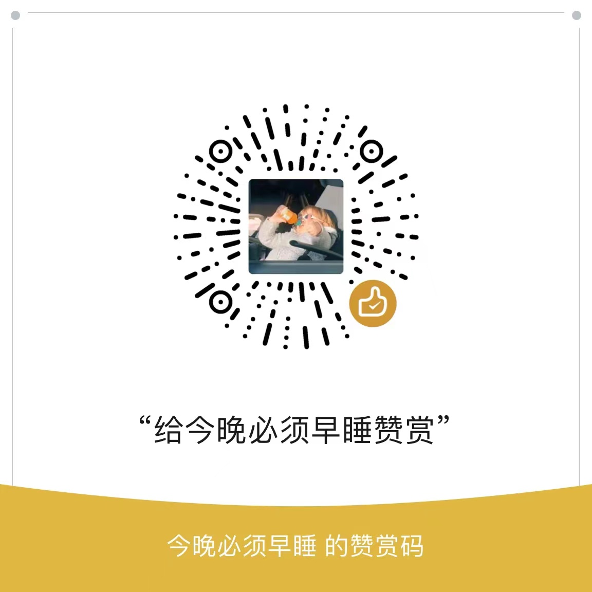

<h1 align="center">基于DDD架构的Web管理系统</h1>

 

 

## 项目说明

本项目使用 **DDD**架构进行开发,服务端使用**SpringBoot + MyBatisPlus + ElasticSearch + Canal**来实现,数据库采用了**MySQL、Redis**

## 说明

> 本项目是作者在学习DDD架构中的练手项目，仅供学习参考，**项目中有任何问题,请提issue感谢各位**

## 技术栈

### 后端

**SpringBoot + MyBatis + Redis + ElasticSearch + Canal**

## 赞助

如果此项目对你确实有帮助，欢迎给我打赏一杯咖啡～😄

 

## 联系方式

**1、邮箱📮：[waxjava04@163.com](mailto:waxjava04@163.com)**

> **定位主要是临时帮大家解决问题，不发表其他东西，有疑问可以临时联系。**

 

## License

Copyright (c) 2024 wax 

